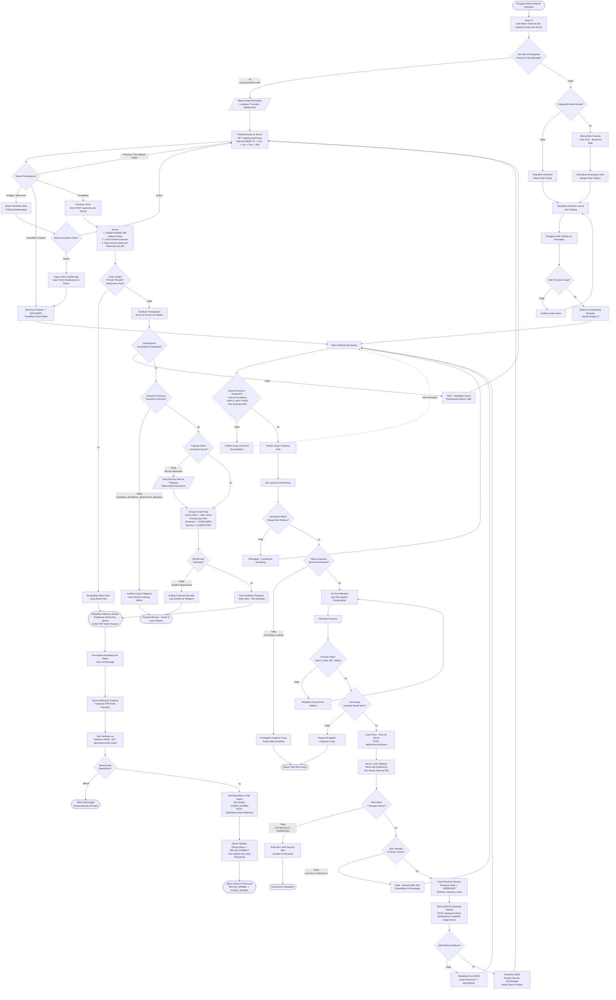

# Workflow Diagram

Diagram alur visual sistem pemesanan Koperasi TWOSRA, dirender langsung oleh GitHub.
Sumber kebenaran narasi tetap `WORKFLOW.md`; file ini hanya pendamping visual.

```mermaid
flowchart TD

%% FASE A: BUKA WEBSITE DAN CEK SESI LAMA

    A1([Pengguna Buka Website TWOSRA])
    A1 --> A2[Muat UI<br/>Cek Status Koperasi dan Katalog Produk dari Server]

    A2 --> A3{Ada Sesi Pembayaran<br/>Tertunda di localStorage?}

    A3 -- Ya<br/>masa pemulihan aktif --> REC1[/Masuk Mode Pemulihan<br/>Lanjutkan Transaksi Sebelumnya/]
    REC1 --> F1

    A3 -- Tidak --> A4{Katalog Berhasil Dimuat?}

    A4 -- Tidak --> A5[Tampilkan Halaman:<br/>Belum Ada Produk]
    A4 -- Ya --> A6[Hitung Stok Tersedia<br/>= Stok Fisik - Reservasi Aktif]

    A6 --> A7[Sesuaikan Keranjang Lama<br/>dengan Stok Terbaru]
    A5 --> A8[Tampilkan Halaman Utama dan Katalog]
    A7 --> A8

%% FASE B: KERANJANG

    A8 --> B1[Pengguna Klik Tambah ke Keranjang]
    B1 --> B2{Stok Tersedia Cukup?}

    B2 -- Tidak --> B3[Notifikasi Stok Habis]
    B3 --> A8

    B2 -- Ya --> B4[Simpan ke Keranjang Browser<br/>Update Badge UI]
    B4 --> B5[Buka Halaman Keranjang]

    B5 --> B6{Syarat Checkout Terpenuhi?<br/>- Ada Isi Keranjang<br/>- Maks 5 Jenis Produk<br/>- Min Total Rp1.000}

    B6 -- Tidak --> B7[Tombol Lanjut Checkout<br/>Dinonaktifkan]
    B7 -. Edit Keranjang .-> B5

    B6 -- Ya --> B8[Tombol Lanjut Checkout Aktif]

%% FASE C: FORM CHECKOUT DAN VALIDASI STATUS WEB

    B8 --> C1[Klik Lanjut ke Pemesanan]
    C1 --> C2{Keranjang Masih<br/>Sesuai Stok Terbaru?}

    C2 -- Tidak --> C3[Peringatan - Kembali ke Keranjang]
    C3 --> B5

    C2 -- Ya --> C4{Status Koperasi:<br/>Menerima Pesanan?}

    C4 -- Tidak<br/>E-STORE-CLOSED --> C5[Peringatan Koperasi Tutup<br/>Tombol Beli Dimatikan]
    C5 --> STOP1([Siswa Tidak Bisa Lanjut])

    C4 -- Ya --> C6[Isi Form Identitas<br/>dan Pilih Jadwal Pengambilan]

%% FASE D: KIRIM KE SERVER DAN BUAT CHECKOUT SESSION

    C6 --> D1[Klik Kirim Pesanan]
    D1 --> D2{Formulir Valid?<br/>Nama, Kelas, WA, Jadwal}

    D2 -- Tidak --> D3[Tampilkan Pesan Error Validasi]
    D3 --> C6

    D2 -- Ya --> D4{Cek Ulang:<br/>Koperasi Masih Buka?}

    D4 -- Tidak --> D5[Popup Peringatan Koperasi Tutup]
    D5 --> STOP1

    D4 -- Ya --> D6[Kunci Form - Kirim ke Server<br/>POST /api/checkout/session]

    D6 --> D7[Server: Lazy Cleanup Reservasi Kadaluarsa<br/>dan Hitung Total dari DB]

    D7 --> D8{Total Client<br/>= Hitungan Server?}

    D8 -- Tidak<br/>E-CHECKOUT-TAMPERING --> D9[Tolak dan Catat Security Alert<br/>Kembali ke Beranda]
    D9 --> STOP2([Pemesanan Dibatalkan])

    D8 -- Ya --> D10{Stok Tersedia<br/>di Server Cukup?}

    D10 -- Tidak<br/>E-STOCK-CHECKOUT --> D11[Tolak - Detail Konflik Stok<br/>Ditampilkan di Keranjang]
    D11 --> B5

    D10 -- Ya --> D12[Buat Checkout Session<br/>Reservasi Stok -> RESERVED<br/>Terbitkan checkout_token]

%% FASE E: BUAT QRIS

    D12 --> E1[Minta QRIS ke Gateway Pakasir<br/>POST /api/payment/qris<br/>Berdasarkan Snapshot Harga Server]

    E1 --> E2{QRIS Berhasil Dibuat?}

    E2 -- Tidak --> E3[Tampilkan Error QRIS<br/>Lepas Reservasi -> RELEASED]
    E3 --> B5

    E2 -- Ya --> E4[Tampilkan QRIS<br/>Simpan Sesi ke localStorage<br/>Mulai Timer 10 Menit]

%% FASE F: POLLING STATUS PEMBAYARAN

    E4 --> F1[Polling Berkala ke Server<br/>GET /api/payment/status<br/>Interval Adaptif: 5s -> 10s -> 15s -> 20s -> 30s]

    F1 --> F2{Status Pembayaran?}

    F2 -- Pending / Timer Belum Habis --> F1

    F2 -- Ambigu / Rate Limit --> F3[Mode Pemulihan Aktif<br/>Polling Diperpanjang]
    F3 --> F4{Masa Pemulihan Habis?}
    F4 -- Belum --> F1
    F4 -- Sudah --> F5[Hapus Sesi localStorage<br/>Lapor Event Kadaluarsa ke Server]

    F2 -- Cancelled / Expired --> F6[Reservasi Dilepas -> RELEASED<br/>Tampilkan Pesan Batal]
    F5 --> F6
    F6 --> B5

    F2 -- Completed --> G1

%% FASE G: FINALISASI ORDER

    G1[Hentikan Timer<br/>Kirim POST /api/orders ke Server]

    G1 --> G2[Server:<br/>1. Validasi Identitas dan Jadwal Pickup<br/>2. Load Checkout Session<br/>3. Rekonstruksi Order dari Reservasi dan DB]

    G2 --> G3{Order Sudah<br/>Pernah Tercatat?<br/>Idempotent check}

    G3 -- Ya --> G4[Kembalikan Data Order<br/>yang Sudah Ada]
    G4 --> H1

    G3 -- Tidak --> G5[Verifikasi Pembayaran<br/>Server-to-Server ke Pakasir]

    G5 --> G6{Pembayaran<br/>Terverifikasi Completed?}

    G6 -- Tidak --> G7[Tolak - Tampilkan Pesan<br/>Pembayaran Belum Valid]
    G7 --> F1

    G6 -- Ya --> G8{Snapshot Gateway<br/>Tersedia di Session?}

    G8 -- Tidak<br/>GATEWAY_PAYMENT_SNAPSHOT_MISSING --> G9[Incident Log ke Telegram<br/>User Diminta Hubungi Admin]
    G9 --> STOP3([Payment Review - Tahan di Layar Review])

    G8 -- Ya --> G10{Payload Client<br/>= Snapshot Server?}

    G10 -- Tidak<br/>Security Mismatch --> G11[/Catat Security Alert ke Telegram<br/>Tetap Pakai Data Server/]
    G11 --> G12

    G10 -- Ya --> G12[Simpan Order Final<br/>Insert orders + order_items<br/>Potong Stok Fisik<br/>Reservasi -> CONSUMED<br/>Session -> COMPLETED]

    G12 --> G13{DB Berhasil<br/>Disimpan?}

    G13 -- Tidak<br/>Incident Operasional --> G14[Rollback Manual Otomatis<br/>Log Incident ke Telegram]
    G14 --> STOP3

    G13 -- Ya --> G15[Kirim Notifikasi Telegram<br/>Order Baru - Non-blocking]
    G15 --> H1

%% FASE H: SUKSES DAN PENGAMBILAN BARANG

    H1([Tampilkan Halaman Sukses<br/>Ringkasan Resmi dari Server<br/>Unduh PDF Bukti Pesanan])
    H1 --> H2[Kosongkan Keranjang dan Hapus<br/>Sesi localStorage]

    H2 --> H3[Siswa Datang ke Koperasi<br/>Tunjukkan PDF Bukti Pesanan]
    H3 --> H4[Staf Verifikasi via<br/>Halaman Publik - GET /api/orders/verify/:token]

    H4 --> H5{Barang Siap<br/>Diserahkan?}

    H5 -- Belum --> H6([Admin Menunggu<br/>Sampai Barang Tersedia])

    H5 -- Ya --> H7[Staf Buka Menu Order Admin<br/>Klik Tombol SUDAH_DIAMBIL<br/>POST /api/admin/orders/:id/pickup]

    H7 --> H8[Server Validasi:<br/>Pickup Status = BELUM_DIAMBIL?<br/>Lalu Update dan Catat Timestamp]

    H8 --> DONE([Status Terkunci Permanen<br/>BELUM_DIAMBIL -> SUDAH_DIAMBIL])
```
